### Credit Risk Modeling

This repository aims to put in place an end-to-end Credit Risk Assessment, with CI/CD capabilities. Basically, models for estimating the overal Expected Loss (EL) will be trained and properly stored. Hence, we will build a Docker container that will be automatically pushed to AWS ECR for further deployment with AWS Lambda.

In order to properly estimate the total EL, we need three models:

* PD - Probability of Default;

* LGD - Loss Given Default;

* EAD - Exposure at Default.

With all of these target variables properly estimated, computing EL is as straightforward as:

$EL = PD \times LGD \times EAD$


This is the current structure:

```sh
.
├── Dockerfile
├── Makefile
├── README.md
├── credit-risk-modeling
│   ├── credit_risk_modeling
│   │   ├── __init__.py
│   │   ├── base
│   │   │   ├── __init__.py
│   │   │   └── estimator.py
│   │   ├── cleaning
│   │   │   ├── __init__.py
│   │   │   ├── format_data_type.py
│   │   │   ├── parse_numeric_data.py
│   │   │   └── winsorize_numeric.py
│   │   ├── eda
│   │   │   ├── __init__.py
│   │   │   ├── continuous_target.py
│   │   │   ├── fine_classing.py
│   │   │   └── woe.py
│   │   ├── evaluation
│   │   │   ├── __init__.py
│   │   │   ├── metrics.py
│   │   │   └── visualizations.py
│   │   ├── exceptions
│   │   │   ├── __init__.py
│   │   │   ├── base.py
│   │   │   ├── cleaning.py
│   │   │   ├── feature_engineering.py
│   │   │   └── models.py
│   │   ├── feature_engineering
│   │   │   ├── __init__.py
│   │   │   ├── categorize_numeric.py
│   │   │   ├── compute_time_since.py
│   │   │   ├── create_categories.py
│   │   │   └── drop_reference_categories.py
│   │   ├── models
│   │   │   ├── __init__.py
│   │   │   └── regression.py
│   │   └── utils
│   │       ├── __init__.py
│   │       └── compute_score.py
│   ├── setup.py
│   └── tests
│       ├── __init__.py
│       ├── conftest.py
│       ├── test_cleaning
│       │   ├── __init__.py
│       │   ├── test_format_data_type.py
│       │   ├── test_parse_numeric_data.py
│       │   └── test_winsorize_numeric.py
│       ├── test_eda
│       │   ├── __init__.py
│       │   ├── test_fine_classing.py
│       │   └── test_woe.py
│       ├── test_evaluation
│       │   ├── __init__.py
│       │   └── test_metrics.py
│       ├── test_feature_engineering
│       │   ├── __init__.py
│       │   ├── test_categorize_numeric.py
│       │   ├── test_compute_time_since.py
│       │   ├── test_create_categories.py
│       │   └── test_drop_reference_categories.py
│       ├── test_models
│       │   ├── __init__.py
│       │   └── test_regression.py
│       └── utils
│           ├── __init__.py
│           └── test_compute_score.py
├── data
│   ├── .gitkeep
├── models
│   ├── artifacts
│   │   ├── cleaner.pkl
│   │   ├── ead_model.pkl
│   │   ├── ead_preprocessing.pkl
│   │   ├── lgd_model.pkl
│   │   ├── lgd_preprocessing.pkl
│   │   ├── pd_model.pkl
│   │   └── pd_preprocessing.pkl
│   ├── ead_model
│   │   ├── main.py
│   │   ├── output
│   │   │   ├── TEST_regression_evaluation.png
│   │   │   ├── TRAIN_regression_evaluation.png
│   │   │   └── regression_metrics.csv
│   │   └── preprocessing.yml
│   ├── lgd_model
│   │   ├── main.py
│   │   ├── output
│   │   │   ├── TEST_regression_evaluation.png
│   │   │   ├── TRAIN_regression_evaluation.png
│   │   │   └── regression_metrics.csv
│   │   └── preprocessing.yml
│   └── pd_model
│       ├── main.py
│       ├── output
│       │   ├── distribution_TEST.png
│       │   ├── distribution_TRAIN.png
│       │   ├── ks_TEST.png
│       │   ├── ks_TRAIN.png
│       │   ├── model_coefficients.csv
│       │   ├── roc_pr_TEST.png
│       │   ├── roc_pr_TRAIN.png
│       │   ├── test_metrics.csv
│       │   └── train_metrics.csv
│       └── preprocessing.yml
├── notebooks
│   ├── EDA PD Model.ipynb
│   ├── Final EL Analysis.ipynb
│   ├── General Cleaning and Preprocessing.ipynb
│   ├── General Outline EAD Model.ipynb
│   ├── General Outline LGD Model.ipynb
│   └── General Outline PD Model.ipynb
├── requirements.txt
└── serve
    ├── app
    │   ├── __init__.py
    │   ├── data.py
    │   ├── main.py
    │   └── predictor.py
    └── test_app
        ├── __init__.py
        ├── test_main.py
        └── test_predictor.py
```

Under `models` we have sub-folders for each model that gather all the code required for the design, development and evaluation - which is achieved with the help of the script `main.py`, the orchestrator of the whole workflow.

Exploration, preliminary analysis and hyperparameter tuning have been carried out in the notebooks under `notebooks`. There is also deployment source code under `serve`, where we leverage FastAPI and Mangum (wrapper for FastAPI in AWS Lambda) in order to come up with a first draft of a model that could serve predictions in real time. In order to achieve it, we have used containerization as a strategy, given that we have reproducibility and flexibility ensured throughout the process. In this scenario, we used `docker` and leveraged GitHub Actions with AWS services, in order to have **CI/CD in place**. Basically, every time there is a push to the *main* branch, the pipeline is triggered:

- Dependencies are properly installed;
- Linting is run to automatically detect errors;
- Unit tests are run as well, as best practices;
- Final docker image is built and then pushed to AWS ECR, where it is available to be pulled and used for inference;
- AWS Lambda function is updated with new container.

More on the deployment side will follow below.


### 1. Running instructions for training

If you want to carry out training for this project, please follow the instructions below:

1. Clone this repository:

```sh
git clone https://github.com/gfluz94/credit-risk-modeling
```

2. Go to the project folder, create a new virtual environment and install dependencies with the help of `Makefile`:

```sh
cd credit-risk-modeling
python3 -m venv ~/.my-env-name
source ~/.my-env-name/bin/activate
make install
```

3. Execute `main.py` for each model sub-folder with the corresponding flags:

```sh
cd models/pd_model
python3 main.py --verbose --save-evaluation-artifacts
cd ../..
```

```sh
cd models/lgd_model
python3 main.py --verbose --save-evaluation-artifacts
cd ../..
```

```sh
cd models/ead_model
python3 main.py --verbose --save-evaluation-artifacts
cd ../..
```

Model artifacts will be o exported to `models/artifacts`.

It is worth noting that **there are several flags** to customize the execution. For detailed information, please run inside each model sub-folder the following command:

```sh
python3 main.py -h
```


### 2. Deployment

As previously mentioned, there is CI/CD in place in order to test, build and deploy the packaged solution into a productive environment. The strategy is CaaS (Container as a Service), due to several benefits that arise from **microservice deployment**:

- Speed up application development;
- Abstraction from required environment for the application;
- It is easily shareable and reproducible across teams;
- With the advent of container orchestration tools (such as **kubernetes**), it is effiently manageable when several different containerized applications need to run together - which might be the case for credit/fraud policies.

In this mocked example, the image is built and avaible in AWS ECR, which allows it for local use whenever the image is pulled. In a real world scenario, this pushed image would be integrated into one of AWS Services for deployment, such as EKS, EC2 or Lambda, depending upon budget, capacity, redundancy, latency and loading requirements.

In our scenario, for the sake of learning, we are using AWS Lambda, given that is a serverless solution and costs are onyl incurred upon requests. Basically, we have our container stored in Amazon ECR and AWS Lambda fetches it, running upon incoming requests that trigger the function. Amazon API Gateway was chosen to expose the model with an API endpoint, which is protected by an API secret key.

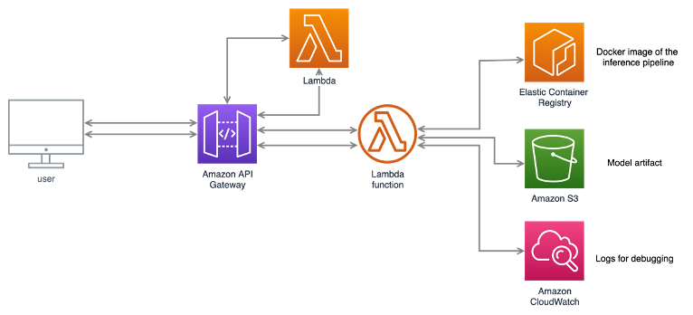

It is possible to test the execution with the following example:

```sh
curl -X 'POST' \
  'https://26n08v03v2.execute-api.us-east-1.amazonaws.com/default/predict' \
  -H 'accept: application/json' \
  -H 'Content-Type: application/json' \
  -H 'x-api-key: <API_KEY>' \
  -d '{
    "id": "sep",
    "member_id": "mv",
    "funded_amnt": 20000,
    "term": "36 months",
    "int_rate": 10,
    "grade": "B",
    "emp_length": "3 years",
    "home_ownership": "MORTGAGE",
    "annual_inc": 80_000,
    "issue_d": "May-15",
    "purpose": "medical",
    "addr_state": "PA",
    "dti": 7.5,
    "earliest_cr_line": "Apr-10",
    "verification_status": "Not Verified",
    "initial_list_status": "w",
    "inq_last_6mths": 0,
    "total_rev_hi_lim": 25_000,
    "delinq_2yrs": 0,
    "pub_rec": 0,
    "open_acc": 5,
    "total_acc": 20
    }'
```

Output:

```sh
{"id": "sep", "member_id": "mv", "funded_amnt": 20000, "PD": 0.37194486655999126, "LGD": 1.0, "EAD": 0.8873217701911926, "EL": 6600.695548190767,}
```

### 3. Credit Risk Assessment

The solution proposed in this repository aims to be compliant with Basel Accord II, since we develop models for the A-IRB approach - in other words, internally estimating probability of default (PD), loss given default (LGD) and exposure at default (EAD), in order to compute expected loss (EL).

#### Probability of Default

PD models need to be **explainable and interpretable**, according to regulators' requirements. Hence, the best approach for this issue is to develop a **credit scorecard**. Hence, we need to have appropriate categories and their corresponding increases/decreases in the Credit Score.

This means that we will work with categorical variables and binned numeric variables. Moreover, since some of the variables might have high cardinality, it might be useful for us to understand how the categories behave with respect to the target variable, and aggregate some of them whenever reasonable.

For this purpose, we use **Weight of Evidence (WoE)**. WoE shows us to what extent an independent variable would predict a dependent one. It is computed for every single category within a variable, according to the following formula:

$WoE_i = \ln{\frac{\%(y=1)_i}{\%(y=0)_i}}$

The further away from zero, the better the category in differentiating between classes.

When using WoE to analyze discrete variables, before choosing appropriate categories, it is important to have the proportion of observations also available, given that **we can combine underrepresented categories**. On the other hand, if a given category stands out, then it should be kept as a single category.

We have trained a **Logistic Regression** model, since it is easily interpretable from the coefficients. For the evaluation, we relied on the following visualizations:

* ROC and PR Curves

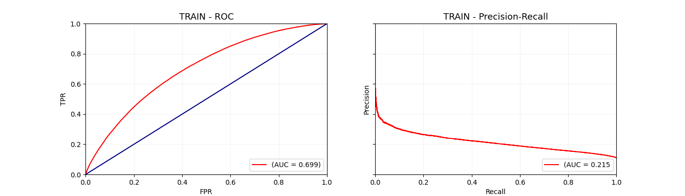
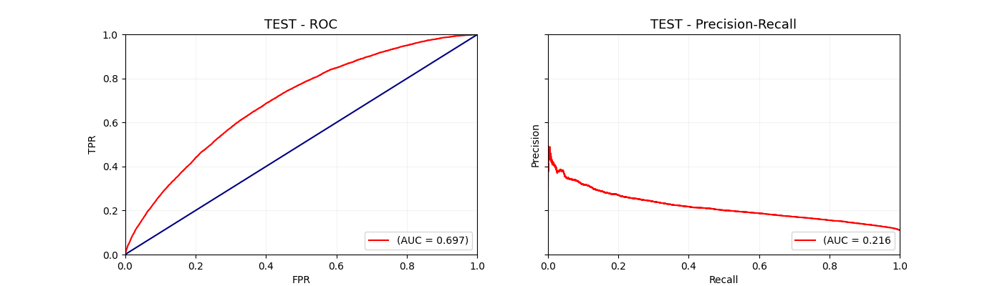

* Kolmogorov-Smirnov Curve

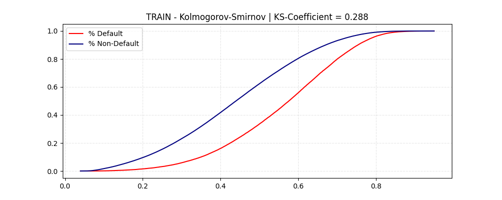
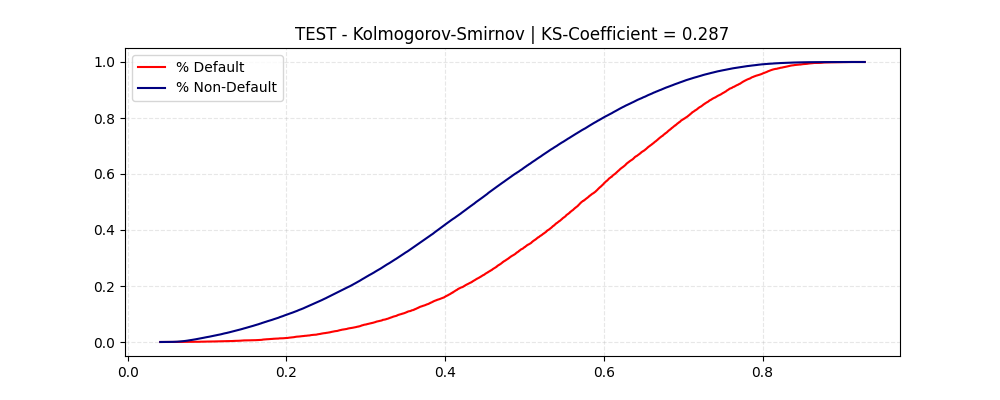

* Credit Score Distribution

n complex ML systems - which is the scenario for credit/fraud policies, models depend on each other. Thus, calibration simplifies interactions, once it allows each model to focus on estimating its particular probabilities as well as possible. And since the interpretation is stable, other system components don’t need to shift whenever models change.

Last but not least, it allows us to make use of credit scores in a way that make more sense rather than probabilities, per se.

It makes sense that the higher the score, the less unlikely an applicant is to default. The scire is usually a logarithmic transformation of the probability of default, so that every 20p decrease in score doubles the default probability.

$score = -\log{\frac{PD}{1-PD}} \times \frac{20}{\log{2}} + 600 -\log{50} \times \frac{20}{\log{2}}$ 

The main advantage, in reality, is that we have increased granularity as probability approaches 0 and 1.

From the distributions of scores for Default and Non-Default individuals, we can see that we can come up with different policies, according to score bands.

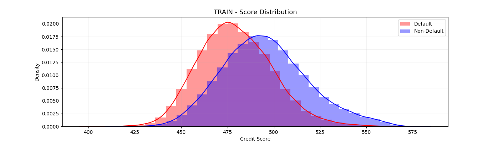
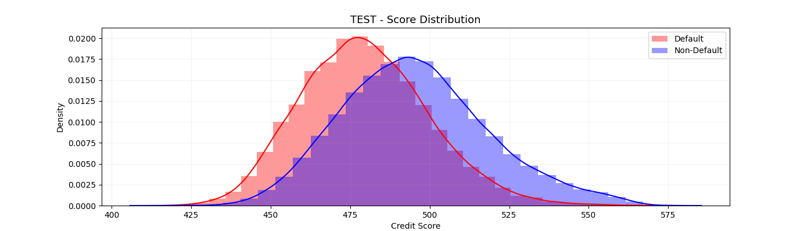

Moreover, we have the following metrics across thresholds for the hold-out set:

|THRESHOLD|# DEFAULT             |RECALL             |PRECISION            |F1                |ROC-AUC           |AVERAGE PRECISION |
|---------|----------------------|-------------------|---------------------|------------------|------------------|------------------|
|0.05     |93251               |1.00                |0.11  |0.20| 0.70|0.22|
|0.10     |91783               |1.00 |0.11  |0.20|0.70|0.22|
|0.15     |88939               |0.99 |0.11  |0.20|0.70|0.22|
|0.20     |85033               |0.99 |0.12  |0.21|0.70|0.22|
|0.25     |79892               |0.97 |0.12  |0.22|0.70|0.22|
|0.30     |73368               |0.94 |0.13  |0.23|0.70|0.22|
|0.35     |65665               |0.90 |0.14   |0.24|0.70|0.22|
|0.40     |56771               |0.84 |0.15  |0.25|0.70|0.22|
|0.45     |47395               |0.76 |0.16   |0.27|0.70|0.22|
|0.50     |38013               |0.66  |0.18  |0.28|0.70|0.22|
|0.55     |29137               |0.55 |0.19   |0.29|0.70|0.22|
|0.60     |20822               |0.43 |0.21  |0.29|0.70|0.22|
|0.65     |13679               |0.32|0.24   |0.27|0.70|0.22|
|0.70     |7800                |0.20|0.27  |0.23|0.70|0.22|
|0.75     |3583                |0.11 |0.32   |0.16|0.70|0.22|
|0.80     |1103                |0.04|0.38  |0.07|0.70|0.22|
|0.85     |183                 |0.01|0.46  |0.02|0.70|0.22|
|0.90     |14                  |0.00|0.29   |0.00|0.70|0.22|
|0.95     |0                   |0.00               |0.00                 |                  |0.70|0.22|


#### Loss Given Default

Our main focus here is to estimate the **Recovery Rate (RR)**, which is simply the inverse of LGD: the proportion of the total exposure that the lender can actually recover. Hence:

$LGD = 1 - RR$

The distribution of `RR` is highly skewed and uneven - there are a lot of 0s. A regular regression algorithm wouldn't be able to deliver satisfactory results, since it is almost unfeasible to predict as many 0s as there are in the data.

Therefore, we need to come up with a solution to specifically address this issue. Our approach will basically consist of a **Zero Inflated Regression** - a meta-model where there is a classifier preceeding the regressor. The classifier is in charge of predicting whether the output is 0. Only the entries for which we predict "non-zero" are going to be fed to the final regressor model.

For the evaluation, we relied on the following visualizations:

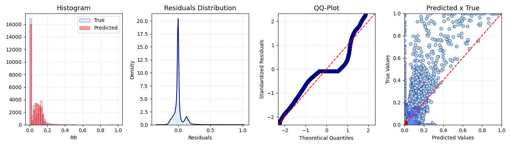
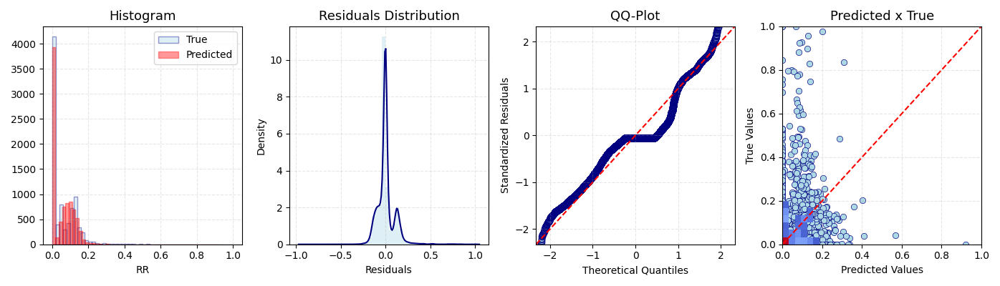


#### Exposure at Default

From the data provided, we know that:

* `funded_amnt`: reflects the total amount the borrower applied for;

* `total_rec_prncp`: amount that has been recovered.

Hence, EAD can be defined as:

$EAD = funded\_amnt - total\_rec\_prncp$

For the sake of simplicity and ease of development, we will instead build a model to predict **CCF - Credit Conversion Factor**, which basically indicates the portion of the original amount that will still be outstanding at the momento fo default.

$CCF = \frac{EAD}{funded\_amnt} = \frac{funded\_amnt - total\_rec\_prncp}{funded\_amnt}$

In this case, we can rely on regular regression, as we do not have a lot of 0s that stand out from the distribution. Hence, for the evaluation we have the following visualizations:

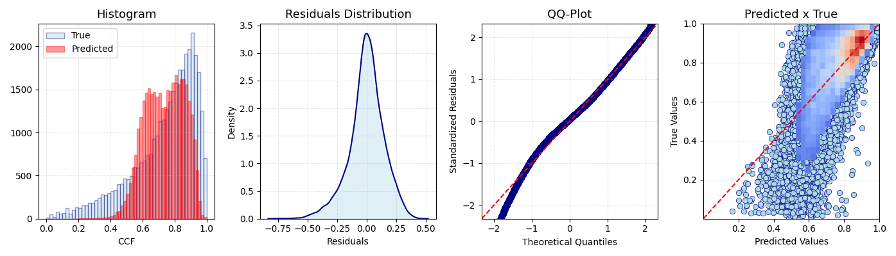
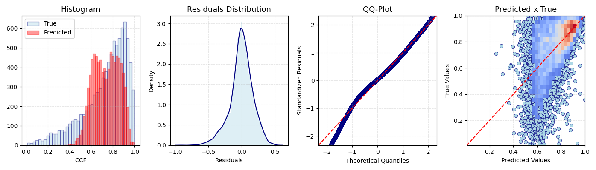

#### Expected Loss

Finally, we are able to estimate the total EL by multiplying all predicted values and the total funded amount. For the whole dataset, we arrive at **$2.2 bn**, which corresponds to roughly 30% of total assets. Usually, this number should be kept within 2-10%.

Remember, EL for the A-IRB approach is the total amount the bank should keep as capital adequacy. Hence, the lower this amount, the more efficient the operation.

___

Contact: gfluz94@gmail.com
